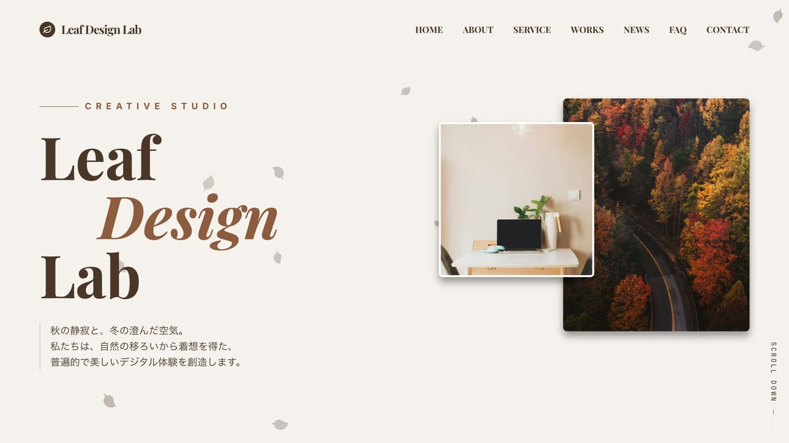

# Webサイト：Leaf Design Lab（WordPress Theme）

## 概要

架空のWeb制作会社「Leaf Design Lab」のコーポレートサイトとして制作したWordPressテーマです。  
デザインはGoogle AI Studioを活用し、コーディングおよびWordPress化はすべて自身で行いました。

実務で求められるテーマ開発の流れを想定し、投稿管理・カスタム投稿・カスタムフィールド・お問い合わせ機能など、運用を前提とした構成で実装しています。

---

## 制作情報

- 作品名：leaf design lab  
- 制作月：2026.04  
- 制作期間：2週間  

---

## URL

https://portfolio.itsseiya.com/leaf-design-lab/

---

    
## 使用技術

- WordPress
- HTML / CSS / SCSS
- JavaScript
- GSAP
- ACF（Advanced Custom Fields）
- CPT UI
- Contact Form 7
- Google AI Studio
- Cursor

---

## 主な機能

- **投稿機能（お知らせ）**
- **カスタム投稿（制作物）**
- **ACFによるカスタムフィールド管理**
- **お問い合わせフォーム（Contact Form 7）**
- **マルチステップフォーム（入力 → 確認 → 送信完了）**
- **template-partsによるコンポーネント化**
- **レスポンシブ対応**

---

## 設計

本テーマでは、「お知らせ」と「制作物」を分けて管理できる構成とし、コンテンツの種類ごとに適切なデータ設計を行いました。

投稿ごとの情報はACFを用いて構造化し、表示の一貫性と柔軟性を両立しています。

また、共通パーツはtemplate-partsとして分割し、保守性・再利用性を高めた設計としています。

---

## 工夫した点

- **カスタム投稿による情報整理**  
  CPT UIを使用し、投稿と制作物を分離。運用時の視認性と拡張性を向上

- **ACFによる入力項目の構造化**  
  投稿ごとに必要な情報を整理し、管理画面での入力負担を軽減

- **マルチステップフォームの導入**  
  入力 → 確認 → 送信のフローにより誤送信を防止

- **template-partsによるコンポーネント化**  
  再利用可能な構造にすることで保守性を向上

- **運用を前提としたテーマ設計**  
  管理画面からの更新を想定し、実務に近い構成で実装

---

## 技術選定の理由

WordPressを採用することで、クライアントが自身でコンテンツを更新できるCMSとしての利便性を実現しました。

また、CPT UIやACFを活用することで、柔軟なデータ設計と開発効率の両立を図っています。

---

## AI活用

本制作ではGoogle AI Studioを活用し、デザインのベースとなるアイデア生成を行いました。

AIによって方向性を可視化した上で、そのまま使用するのではなく、情報設計や視認性を考慮しながらブラッシュアップを行っています。

また、WordPress実装においてもAIを活用し、不明点の解消や実装方針の整理を行いました。  
コードをそのまま使用するのではなく、動作の仕組みを理解することを重視しています。

AIを補助ツールとして活用しつつ、最終的な設計・判断は自ら行うことで、再現性のある開発を意識しました。

---

## 学び

本制作を通して、静的サイトとCMSサイトでは設計の考え方が大きく異なることを実感しました。

特に「誰が更新するか」を前提にした設計の重要性を学び、カスタム投稿やカスタムフィールドによるデータ設計の理解が深まりました。

また、template-partsによる分割を通して、保守性を意識したテーマ設計の重要性を学びました。

---

## 補足

本テーマはポートフォリオ作品として制作した架空のWebサイトです。

---
